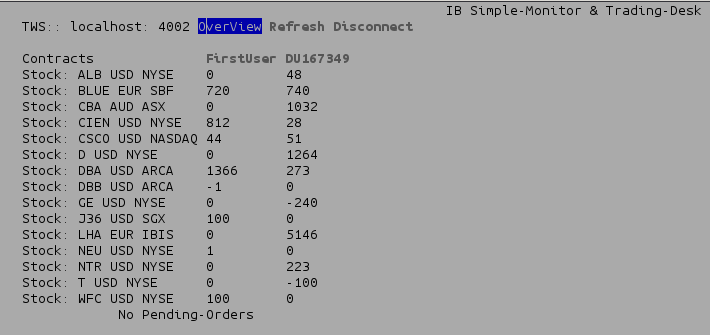
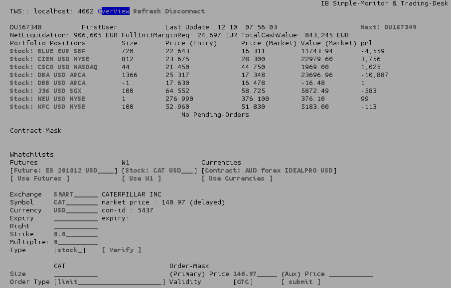

# Simple Monitor
Portfolio-Monitor (not only) for FA-Accounts on InteractiveBrokers

**Base Szenario:** Some trading approach is performed on a remote system. There is at least a reverse-ssh tunnel enabling basic administrative operations. One can establish a remote `tmux`-session, one window is starting the `simple_monitor`, one runs an `elinks`-session displaying the output. 

The monitor is realized with 500 lines of code using __`IB-Ruby`__ and the camping micro-web-framework. It generates pure HTML and uses CSS, thus providing an overview on every browser, including text-based ones, like `elinks`. Avoids JavaScript.

First an overview of any Portfolio-Position in every Account is displayed (only F&F-Accounts).
You can select all Accounts. Basic information, such as *NetLiquidation*, the used *Margin* and *Available Cash*  are shown.  All Portfolio-Positions  (Contracts) are displayed. 


A *Simple Form* to place an emergency-order (i.e. a "Close-Position"-Feature) is provided, too. New Positions can be established through their basic properties (see below). In practice, one would use the [Watchlist](ib-ruby/ib-ruby/wiki/Watchlists) feature 
of **`IB-Ruby`** to provide additional Contracts. 

#### Getting Started

* Install Ruby 2.5+ (via rvm), tmux and elinks.

* clone this repository ( `git clone https://guthub.com/ib-ruby/simple-monitor.git` )
* change to the simple-monitor directory ( `cd simple-monitor`)

* Initialize with `bundle install` following with `bundle update`   ( get bundler via `gem install bundle` if its not present)

* Start a TWS or a Gateway (TWS must fullfil the requirements of ›› [IB-RUBY]( https://github.com/ib-ruby/ib-ruby/) ‹‹).

* Edit `tws-alias.yml`  and change the `:host`-Entry to the host running the TWS/Gateway (eg. `localhost:7496`).
  If a connection is made with the Gateway, specify that port, too, eg `localhost:4001`. If no Account-Alias is set in 
  Account-Management, local Aliases can be specified in the yaml-dataset.

* Copy the provided elinks-configuration to the home-directory ( `cp elinks.conf ~/.elinks/elinks.conf` )

* Run the provided tmux-startup-script  ( `./start-simple-monitor` )  **or**

  Run the camping-Server manually and open a browser window at http://localhost:3333
```
camping simple_monitor.rb -p 3333
```

enjoy


#### The Output
If an ascii-Browser like `elinks` is used, the following output is generated


If a User is selected or only one User is present, a detail-page is displayed



